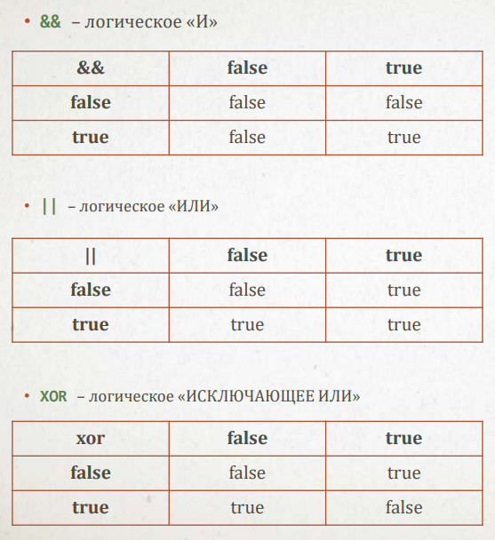

## Функции, операторы контроля. Включение файлов.
***


### Тип - это определение того, что может быть значением.
Boolean (bool) - тип, имеющий всего два значения.
Булевы значения играют огромную роль в php. На них построены различные условия, многие функции принимают и возвращают булевы значения.
### Приведение к boolean (casting):
#### Следующие значения рассматриваются как FALSE:
- само значение boolean FALSE;
- integer 0 и -0;
- float 0.0 и -0.0;
- пустая строка '', и строка '0';
- массив без элементов;
- особый тип null (включая не установленные переменны);
- объекты SimpleXml, созданные из пустых тегов.
#### Все остальные значения рассматриваются как TRUE.
Булевы операторы - операторы, который работают с булевыми значениями:
- && - логическое "И"
- || - логическое "ИЛИ"
- XOR - логическое "ИСКЛЮЧАЮЩЕЕ ИЛИ"


___


## Ветвление
### Ветвление - это оператор php, определяющий, должен ли выполняться тот или иной код в зависимости от чего-либо.
```php
if ($x > $y) {
    $m = $x;
} else {
    $m = $y;
}
```

### Сокращенная форма:
```php
if ($stm) {
    ...
}
```
### Форма с перебором:
```php
if ($stm) {
    ...
} elseif ($stm2) {
    ...
} else {
    ...
}
```

Важно:
- Всегда писать фигурные скобки;
- При сравнении помнить - переменная справа.


### Оператор switch
```php
switch ($stm) {
    case 1:
        run1();
        break;
    case 2:
        run2();
        break;
    default:
        run();
        break;
}
```
- break прерывает перебор условий;
- секция default выполнится, если не совпало ни одно сравнение, ее может и не быть;
- и $stm и значения в case могут быть любым - проверяется просто их равенство (нестрогое);
- несколько case могут быть записаны один за другим и отвечать за один и тот же случай.
```php
function cals($operation, $a, $b) {
    switch ($operation) {
        case '+':
            return $a + $b;
            break;
        case '-':
            return $a - $b;
            break;
        case '*':
            return $a * $b;
            break;
    }
}
```
___


## Функция
### Функция - это подпрограмма, имеющая имя, набор входных значений (аргументов) и возвращаемое значение (необязательно).

```php
function maxnum($a, $b) {
    if ($a > $b) {
        return $a;
    } else {
        return $b;
    }
}

$m = maxnum(3, 5);
echo maxnum(-1, 1);
```
- Имя функции должно быть уникальным и не совпадать с именем библиотечной функции;
- return - это оператор возврата значения из функции. Их может быть несколько или не быть вообще. Оператор прерывает выполнение функции;
- Все переменные, объявленные в функции, будут локальными и перестанут существовать после выхода из нее;
- Глобальные переменные недоступны в функции.
___


## Константа
### Константа - это значение, которое однажды создается и больше изменяться не может.
Константы задаются с помощью ключевого слова const и, в отличие от переменных, не имеют знака $:
~~~php
const PI = 3.14159;
const SEC_IN_DAY = 86400;
const HOST = 'localhost';
~~~

- Имена констант принято записывать большими буквами;
- Значением константы может быть число, строка, логическое значение - то, что не требует вычисления.
___


## Включение файлов
### Архитектурно верно разделять свою программу на отдельные файлы.
В качестве первого шага к хорошей архитектуре можно собрать в один файл функции, а в другие файлы тот код, который их использует.
~~~php
include __DIR__ . '/functions.php';
~~~
- __DIR__ - "магическая" константа. Она всегда содержит в себе полный путь в файловой системе до папки с текущим файлом;
- include - подключает файл, в случае его недоступности - выведет предупреждение, но продолжит работу программы (успешно - 1, неуспешно - false и возникнет E_WARNING);
- require - подключает файл, но в случае его недоступности вызовет фатальную ошибку и завершит программу (успешно - 1, неуспешно - false и E_COMPILE_ERROR);
- include_once и require_once не будут подключать указанный фай, если он уже ранее был подключен.
___


## Тесты
### Модульный тест - это код, содержащий утверждения о том, как должны работать отдельные модули (части) программы.
В php принято использовать модульные тесты для того, чтобы доказать, что программа работает верно, и чтобы отслеживать ошибки при изменении кода.
~~~php
function maxnumber($a, $b) {
    ...
}

assert( 1 === maxnumber(1, 1));
assert( 1 === maxnumber(-1, 1));
assert( 1 === maxnumber(1, -1));
~~~
- Необходимо писать тесты до написания кода;
- Использовать конструкцию assert, она встроена в язык;

### Установить настройки:
- display_errors On
- error_reporting E_ALL
- zend.assertions = 1